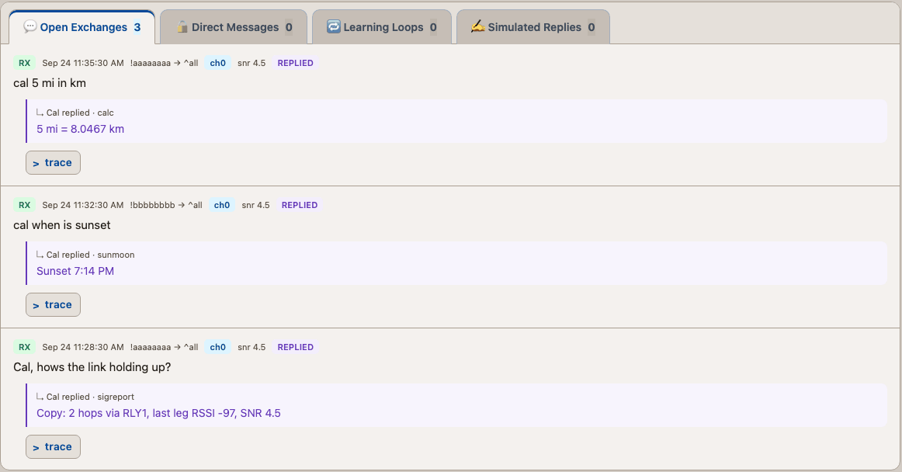
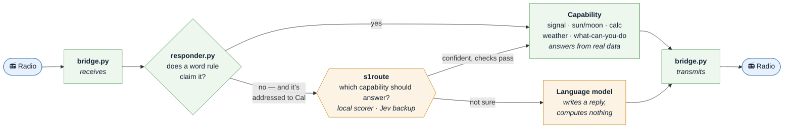

# cal-mesh — an AI station on a Meshtastic radio mesh



*The public dashboard: each question, the capability that answered it, and what went out on air.
Illustrative data with placeholder node IDs; the replies are in Cal's real formats.*

> **Status:** one operator's station, shared so you can build your own. It runs every day, but it
> is not a product and no support is promised. Forks and issues are welcome.

Cal is a station on a LoRa mesh that answers questions over the air: a **field reference that
still answers when nothing else can**. It runs on a laptop and a LilyGO T-Deck, and apart from
the radio bridge it is Python's standard library only. Seven capabilities answer from code, the
radio or a vetted table (signal reports, sun and moon, maths and RF, radio and mesh terms,
weather, a capability list, a greeting). Anyone who names Cal can get the offline ones.
A language model answers only what none of them claim, and words the weather report around
numbers that were fetched; every number on air comes from code or the radio. When no rule
claims a message, a small open model on a second laptop can route it to the right capability in
~13 s, with TypeSafe's Jev as a cloud backup at ~$0.00003 a decision. Every capability ships
switched off until 38 eval suites and an independent adversarial review pass. Now and then it
says good morning or asks for a radio check, like any other station.

**What it won't do is as much of the design as what it will.** Each capability has an explicit
point where it says "I can't verify that" rather than guessing.

## Example

> **Cal, hows the link holding up?**
> Copy: 2 hops via RLY1, last leg RSSI -97, SNR 4.5 &nbsp;&nbsp;*— signal report: the radio's own numbers*
>
> **cal wavelength of 915 mhz**
> 915 MHz: wavelength 12.9 in, quarter-wave 3.2 in (free space) &nbsp;&nbsp;*— calc: computed in Python*
>
> **cal 5 mi in km**
> 5 mi = 8.0467 km &nbsp;&nbsp;*— calc*
>
> **cal what's tropo?**
> Tropo (tropospheric ducting) is propagation that can occur when warm air overruns cold air: a temperature inversion. &nbsp;&nbsp;*— radio terms: from a vetted table, source ARRL's glossary*
>
> **cal when is sunset**
> Sunset 7:14 PM &nbsp;&nbsp;*— sun/moon: works with no internet at all*

## How it works



Green is plain code; amber is where a model is involved. `bridge.py` is the only process that
touches the radio, and `dashboard.py` publishes every decision along the way.

- **Capabilities first, model last.** Each capability is a small deterministic program that
  claims a message with a word rule and answers from real data. The model only sees what nothing
  else claimed, and it never produces a number.
- **Second-opinion routing.** When no rule claims a message addressed to Cal, a decision model
  may pick which capability should answer. It writes nothing. The primary scorer is a frozen
  open model on a laptop in the house, and Jev (TypeSafe AI) is the backup for public messages.
  → [`docs/router.md`](docs/router.md)
- **Fail open to today.** Any failure in anything optional leaves Cal doing what it did without
  that part.
- **Everything is on the page.** Each reply's trace shows which rule, capability or model
  produced it. Positions are coarsened. No coordinates or credentials are published.

## The files that matter

- **`bridge.py`** — the only process that touches the radio. Writes what it hears to
  `inbox.jsonl`, transmits what appears in `outbox/`.
- **`responder.py`** — the decision. Gates, word rules, capabilities, and the model as the last
  resort. Every decision goes to `decisions.jsonl`.
- **`s1route.py`** — the second opinion on a message no rule claimed. Picks a capability; writes
  nothing.
- **`sigreport.py`, `sunmoon.py`, `calc.py`, `weather.py`, `capabilities.py`** — the capabilities.
- **`dashboard.py`** — the public page and the per-reply decision trace (stdlib HTTP server).
- **`config`** — every switch, re-read live. Start from `config.example`.
- **`kb.py`** + **`data/radio_kb.json`** — radio and mesh definitions, each with its source.
- **`presence.py`** — the occasional greeting or radio check.
- **`evals/`** — 38 suites; `./run-evals.sh` decides whether anything ships.

## What Cal answers

| Capability | Where the answer comes from | Who can ask |
|---|---|---|
| Signal report ("range test", "you copy?") | the radio's own measurements | anyone; runs first |
| Sun / moon / twilight | computed in Python; works offline | anyone who names Cal |
| Arithmetic, units, RF formulas | computed in Python | anyone who names Cal |
| Radio and mesh terms ("what's tropo?") | a vetted table; every entry cites its source | anyone who names Cal |
| "What can you do" | the live config flags | anyone who names Cal |
| Greeting ack | a fixed table, once a day | strangers |
| Current weather | fetched from NWS; model narrates the fact only | allow-listed nodes |
| Second-opinion routing | picks one of the above; writes nothing | allow-listed nodes |
| Anything else addressed to Cal | a language model, no tools, no private context | allow-listed nodes |

A model, a fetch or the router is only ever reached by an allow-listed node. For everyone else,
Cal answers from code or the table, or not at all.

What each one refuses, and why two were designed and then killed: [`docs/capabilities.md`](docs/capabilities.md).
The live list, with every limit, is on the dashboard's capabilities page.

## Run it

**Requirements:** a Meshtastic radio reachable over USB or its TCP API (port 4403), macOS or
Linux, Python 3.12+. Optional: `node` (3 eval suites), the `claude` CLI (model replies), a spare
Linux box (local routing scorer), a TypeSafe key (cloud backup).

```bash
# 1. Clone. The scripts expect this exact path.
git clone https://github.com/deanssamclaw/cal-mesh.git ~/cal-mesh && cd ~/cal-mesh

# 2. Install the radio library (~1 min)
python3 -m venv .venv && .venv/bin/pip install -r requirements.txt

# 3. Configure: TRANSPORT, PORT or HOST, ALLOW_FROM. Leave RESPONDER_ENABLED=false.
cp config.example config

# 4. If TRANSPORT=tcp, the radio's API must answer first
nc -vz meshtastic.local 4403

# 5. Run the evals (~3 min)
./run-evals.sh
```

If step 5 ends `GREEN — every suite ran and passed.`, your setup works. A fresh clone shows
**amber** (a few SKIPs) until the bridge has captured some traffic; FAIL is never expected. Then
start the services from [`deploy/`](deploy) and run `./mesh watch` to see traffic arrive. Leave
the responder off for a week and read `decisions.jsonl`: it shows what your mesh actually asks and
what Cal would have said. Hardware and reasoning: [`docs/design-essay.md`](docs/design-essay.md).

**Off switches** (config is re-read live, no restart):
- `RESPONDER_ENABLED=false` is the master switch: Cal transmits nothing on his own (no reply,
  signal report, greeting or probe). Manual `./mesh send` still works.
- Each capability also has its own `*_ENABLED`.
- `S1_ROUTE_ENABLED=false` turns routing off, and `S1_FALLBACK=none` stops anything going to the
  cloud.

## Docs

| | |
|---|---|
| [`docs/design-essay.md`](docs/design-essay.md) | what this is, why it is built this way, and how to build one |
| [`docs/router.md`](docs/router.md) | runbook: add second-opinion routing with a local scorer and a cloud backup |
| [`docs/capabilities.md`](docs/capabilities.md) | each capability, the signal report and contact reports, what was refused |
| [`docs/addressing.md`](docs/addressing.md) | when a message counts as Cal's; direct messages |
| [`docs/trace-and-privacy.md`](docs/trace-and-privacy.md) | the public decision trace; what is coarsened or withheld |
| [`docs/learning.md`](docs/learning.md) | simulated replies, public grading, and the learning loop |
| [`docs/operations.md`](docs/operations.md) | processes, files, transport, config hot-reload, standing facts |
| [`docs/router-record.md`](docs/router-record.md) | how routing was decided, measured and armed |
| [`docs/proposals/`](docs/proposals) | design proposals, including the ones that lost |
| [`deploy/`](deploy) · [`tools/system-one/`](tools/system-one) | service definitions · the local routing scorer |

## Acknowledgements

- [Meshtastic](https://meshtastic.org) — the firmware and the Python library the bridge uses.
- [SemIf](https://github.com/TheoLeeCJ/SemIf-OpenJev) (MIT) — the option scorer behind the local
  routing model.
- [Qwen3.5-4B](https://huggingface.co/Qwen/Qwen3.5-4B) via
  [bartowski's GGUF](https://huggingface.co/bartowski/Qwen_Qwen3.5-4B-GGUF) — the frozen model it
  scores with.
- [TypeSafe AI](https://typesafe.ai) — Jev, the cloud System One model the router was first
  built against and now falls back to.
- [NOAA / National Weather Service](https://www.weather.gov) — current conditions (public
  domain).


## License

[GPL-3.0](LICENSE), the same license as Meshtastic itself. Copyright © 2026 deanssamclaw. You may
use, change and share this code, but if you distribute a modified version you must share its
source under the GPL too. The dependencies keep their own licenses: Meshtastic's Python library is
GPL-3.0; SemIf, pypubsub and protobuf are permissive. Model weights are downloaded separately and
are not part of this repo.
